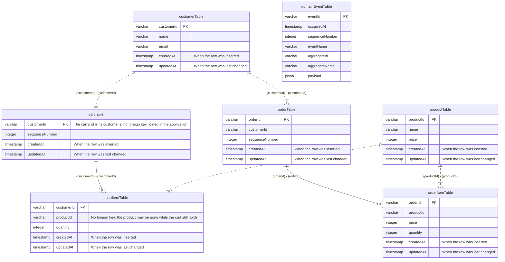

```mermaid
erDiagram
    cartTable ||--|{ cartItemTable : "(customerId) - (customerId)"
    orderTable ||--|{ orderItemTable : "(orderId) - (orderId)"
    customerTable ||..|| cartTable : "(customerId) - (customerId)"
    productTable ||..|{ cartItemTable : "(productId) - (productId)"
    customerTable ||..|{ orderTable : "(customerId) - (customerId)"
    productTable ||..|{ orderItemTable : "(productId) - (productId)"
    cartTable {
        varchar customerId PK "The cart's id is its customer's: no foreign key, joined in the application"
        integer sequenceNumber
        timestamp createdAt "When the row was inserted"
        timestamp updatedAt "When the row was last changed"
    }
    cartItemTable {
        varchar customerId FK
        varchar productId "No foreign key: the product may be gone while the cart still holds it"
        integer quantity
        timestamp createdAt "When the row was inserted"
        timestamp updatedAt "When the row was last changed"
    }
    customerTable {
        varchar customerId PK
        varchar name
        varchar email
        timestamp createdAt "When the row was inserted"
        timestamp updatedAt "When the row was last changed"
    }
    domainEventTable {
        varchar eventId PK
        timestamp occurredAt
        integer sequenceNumber
        varchar eventName
        varchar aggregateId
        varchar aggregateName
        jsonb payload
    }
    orderTable {
        varchar orderId PK
        varchar customerId
        integer sequenceNumber
        timestamp createdAt "When the row was inserted"
        timestamp updatedAt "When the row was last changed"
    }
    orderItemTable {
        varchar orderId FK
        varchar productId
        integer price
        integer quantity
        timestamp createdAt "When the row was inserted"
        timestamp updatedAt "When the row was last changed"
    }
    productTable {
        varchar productId PK
        varchar name
        integer price
        timestamp createdAt "When the row was inserted"
        timestamp updatedAt "When the row was last changed"
    }
```
