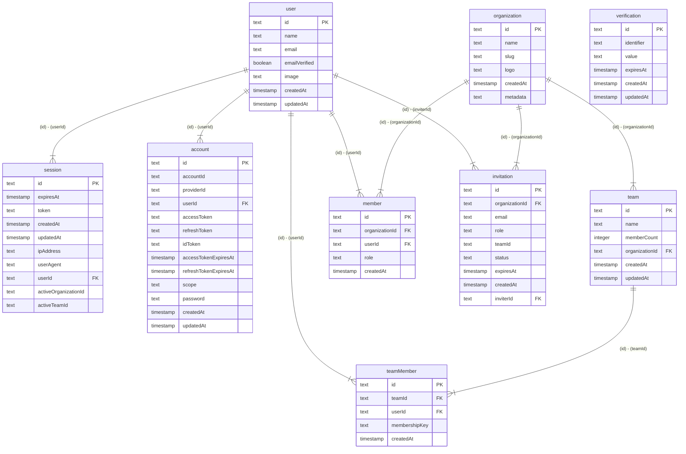

```mermaid
erDiagram
    user ||--|{ session : "(id) - (userId)"
    user ||--|{ account : "(id) - (userId)"
    organization ||--|{ team : "(id) - (organizationId)"
    team ||--|{ teamMember : "(id) - (teamId)"
    user ||--|{ teamMember : "(id) - (userId)"
    organization ||--|{ member : "(id) - (organizationId)"
    user ||--|{ member : "(id) - (userId)"
    organization ||--|{ invitation : "(id) - (organizationId)"
    user ||--|{ invitation : "(id) - (inviterId)"
    user {
        text id PK
        text name
        text email
        boolean emailVerified
        text image
        timestamp createdAt
        timestamp updatedAt
    }
    session {
        text id PK
        timestamp expiresAt
        text token
        timestamp createdAt
        timestamp updatedAt
        text ipAddress
        text userAgent
        text userId FK
        text activeOrganizationId
        text activeTeamId
    }
    account {
        text id PK
        text accountId
        text providerId
        text userId FK
        text accessToken
        text refreshToken
        text idToken
        timestamp accessTokenExpiresAt
        timestamp refreshTokenExpiresAt
        text scope
        text password
        timestamp createdAt
        timestamp updatedAt
    }
    verification {
        text id PK
        text identifier
        text value
        timestamp expiresAt
        timestamp createdAt
        timestamp updatedAt
    }
    organization {
        text id PK
        text name
        text slug
        text logo
        timestamp createdAt
        text metadata
    }
    team {
        text id PK
        text name
        integer memberCount
        text organizationId FK
        timestamp createdAt
        timestamp updatedAt
    }
    teamMember {
        text id PK
        text teamId FK
        text userId FK
        text membershipKey
        timestamp createdAt
    }
    member {
        text id PK
        text organizationId FK
        text userId FK
        text role
        timestamp createdAt
    }
    invitation {
        text id PK
        text organizationId FK
        text email
        text role
        text teamId
        text status
        timestamp expiresAt
        timestamp createdAt
        text inviterId FK
    }
```
