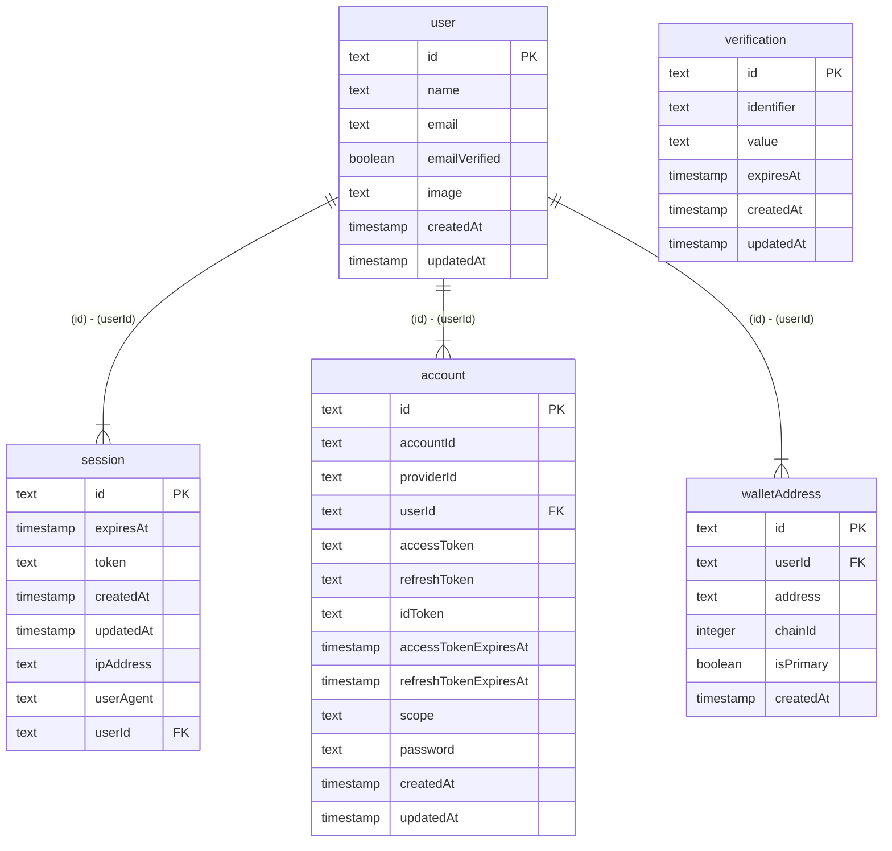

```mermaid
erDiagram
    user ||--|{ session : "(id) - (userId)"
    user ||--|{ account : "(id) - (userId)"
    user ||--|{ walletAddress : "(id) - (userId)"
    user {
        text id PK
        text name
        text email
        boolean emailVerified
        text image
        timestamp createdAt
        timestamp updatedAt
    }
    session {
        text id PK
        timestamp expiresAt
        text token
        timestamp createdAt
        timestamp updatedAt
        text ipAddress
        text userAgent
        text userId FK
    }
    account {
        text id PK
        text accountId
        text providerId
        text userId FK
        text accessToken
        text refreshToken
        text idToken
        timestamp accessTokenExpiresAt
        timestamp refreshTokenExpiresAt
        text scope
        text password
        timestamp createdAt
        timestamp updatedAt
    }
    verification {
        text id PK
        text identifier
        text value
        timestamp expiresAt
        timestamp createdAt
        timestamp updatedAt
    }
    walletAddress {
        text id PK
        text userId FK
        text address
        integer chainId
        boolean isPrimary
        timestamp createdAt
    }
```
